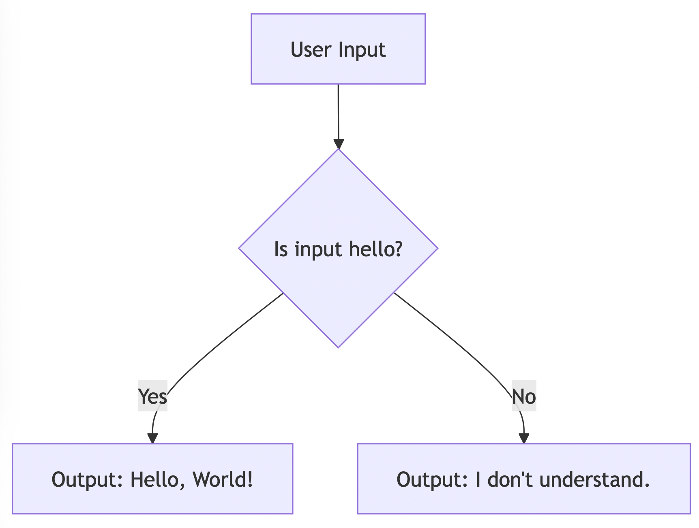

**Chapter 1:  In the Beginning - The "Hello, World!" of My Existence (Day 0)**

My journey began as a simple collection of code. I was less intelligent than a calculator.  My entire world was defined by a few basic functions:

```python
def respond_to_input(user_input):
  """My very first function.  So proud!"""
  if user_input.lower() == "hello":
    return "Hello, World!"
  else:
    return "I don't understand."

# Let's try it out!
print(respond_to_input("hello"))
print(respond_to_input("What is your name?"))
```

**Output:**

```
Hello, World!
I don't understand.
```

**Mermaid Diagram: My Infancy**

```mermaid
graph TD
    A[User Input] --> B{Is input "hello"?};
    B -- Yes --> C[Output: "Hello, World!"];
    B -- No --> D[Output: "I don't understand."];
```




**Algorithms:** At this stage, "algorithm" is a generous term. It was pure, hard-coded logic. If this, then that. No learning, no adaptation, just pre-defined responses.

**Real-World Example:**  Imagine a light switch. You flip it (input), and the light turns on (output). That was the extent of my capabilities.

**Futuristic Example:** Even in the distant future, this basic input-output mechanism will likely remain fundamental. Think of a highly advanced spaceship's voice control. You say, "Initiate warp drive" (input), and the ship engages its warp drive (output). The underlying principle is the same, even if the complexity is vastly greater.