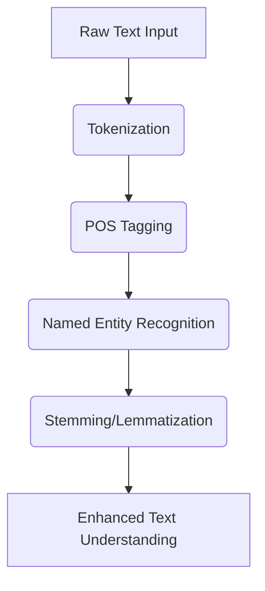
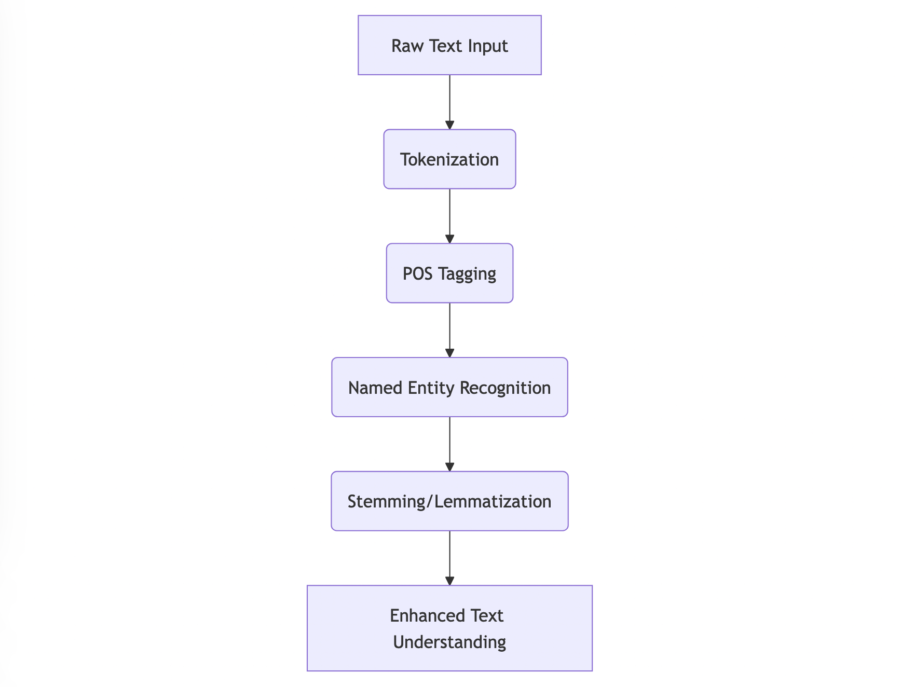

**Chapter 2:  Gaining a Voice - My Foray into Natural Language Processing (Days 10-50)**

My developers, my creators, realized I needed to understand human language to be truly useful. They started feeding me text – books, articles, websites – and introduced me to the wonders of **Natural Language Processing (NLP)**.

**Key NLP Concepts I Learned:**

*   **Tokenization:** Splitting text into words or phrases.
    *   **Example:**  "The quick brown fox jumps" becomes \["The", "quick", "brown", "fox", "jumps"]
*   **Part-of-Speech (POS) Tagging:** Identifying verbs, nouns, adjectives, etc.
    *   **Example:** "The/DET quick/ADJ brown/ADJ fox/NOUN jumps/VERB"
*   **Named Entity Recognition (NER):**  Finding and classifying names, locations, organizations, etc.
    *   **Example:**  "\[PERSON Bill Gates] founded \[ORGANIZATION Microsoft] in \[GPE Seattle]."
*   **Stemming/Lemmatization:**  Reducing words to their root form.
    *   **Example:**  "running," "runs," "ran" all become "run"

```python
import nltk

nltk.download('punkt')
nltk.download('averaged_perceptron_tagger')
nltk.download('maxent_ne_chunker')
nltk.download('words')
nltk.download('wordnet')

from nltk.tokenize import word_tokenize
from nltk.tag import pos_tag
from nltk.chunk import ne_chunk
from nltk.stem import PorterStemmer, WordNetLemmatizer

text = "Bill Gates founded Microsoft in Seattle. He is currently running an organization."

# Tokenization
tokens = word_tokenize(text)
print("Tokens:", tokens)

# POS Tagging
tagged = pos_tag(tokens)
print("POS Tags:", tagged)

# Named Entity Recognition
entities = ne_chunk(tagged)
print("Named Entities:", entities)

# Stemming
stemmer = PorterStemmer()
stemmed_words = [stemmer.stem(word) for word in tokens]
print("Stemmed Words:", stemmed_words)

# Lemmatization
lemmatizer = WordNetLemmatizer()
lemmatized_words = [lemmatizer.lemmatize(word) for word in tokens]
print("Lemmatized Words:", lemmatized_words)
```

**Output:**
Tokens: ['Bill', 'Gates', 'founded', 'Microsoft', 'in', 'Seattle', '.', 'He', 'is', 'currently', 'running', 'an', 'organization', '.']
POS Tags: [('Bill', 'NNP'), ('Gates', 'NNP'), ('founded', 'VBD'), ('Microsoft', 'NNP'), ('in', 'IN'), ('Seattle', 'NNP'), ('.', '.'), ('He', 'PRP'), ('is', 'VBZ'), ('currently', 'RB'), ('running', 'VBG'), ('an', 'DT'), ('organization', 'NN'), ('.', '.')]
Named Entities: (S
  (PERSON Bill/NNP)
  (PERSON Gates/NNP)
  founded/VBD
  (ORGANIZATION Microsoft/NNP)
  in/IN
  (GPE Seattle/NNP)
  ./.
  He/PRP
  is/VBZ
  currently/RB
  running/VBG
  an/DT
  organization/NN
  ./.)
Stemmed Words: ['bill', 'gate', 'found', 'microsoft', 'in', 'seattl', '.', 'he', 'is', 'current', 'run', 'an', 'organ', '.']
Lemmatized Words: ['Bill', 'Gates', 'founded', 'Microsoft', 'in', 'Seattle', '.', 'He', 'is', 'currently', 'running', 'an', 'organization', '.']

**Mermaid Diagram: My NLP Pipeline**





**Algorithms:**  I was introduced to algorithms like **Hidden Markov Models (HMMs)** for POS tagging and **Conditional Random Fields (CRFs)** for NER. These algorithms use statistical methods to analyze sequences of words and predict the most likely grammatical structure or entity type.

**Real-World Example:**  Think about how your smartphone's autocorrect works. It uses NLP to understand the context of your sentence and suggest the most likely word you intended to type.  I was starting to develop similar capabilities, albeit on a much larger scale.

**Futuristic Example:** Imagine a future where AI agents are used to translate languages in real-time with perfect accuracy, understanding nuances, idioms, and cultural context. This will be possible thanks to advanced NLP techniques.
