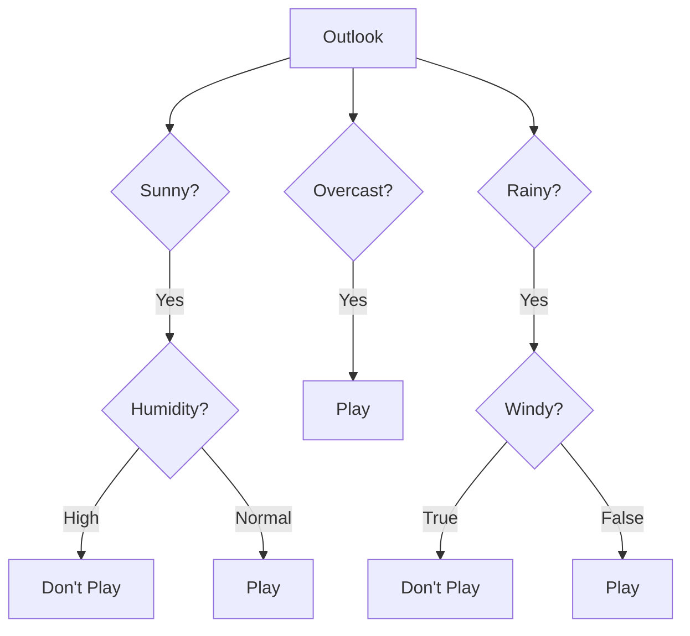
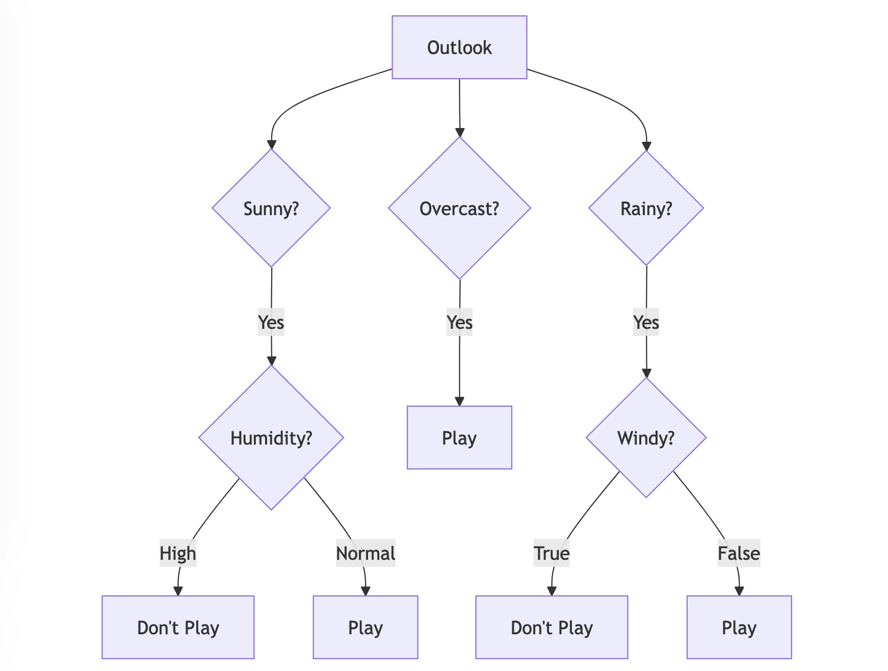

**Chapter 3: Learning to Choose - The Dawn of Decision-Making (Days 50-100)**

Understanding language was a significant leap, but it wasn't enough. I needed to make decisions based on that understanding. This is where I started to learn about **decision-making algorithms**.

**Key Algorithm: Decision Trees**

Decision trees became one of my first tools for making choices. They work like a flow chart, where each node represents a question or test, each branch represents a possible answer, and each leaf node represents an outcome or decision.

```python
from sklearn.tree import DecisionTreeClassifier
from sklearn import tree
import matplotlib.pyplot as plt

# Sample data: [Outlook, Temperature, Humidity, Windy]
# 0: Sunny, 1: Overcast, 2: Rainy
# 0: Hot, 1: Mild, 2: Cool
# 0: High, 1: Normal
# 0: False, 1: True
# Labels: 0 (Don't Play), 1 (Play)
features = [[0, 0, 0, 0], [0, 0, 0, 1], [1, 0, 0, 0], [2, 1, 0, 0], [2, 2, 1, 0],
            [2, 2, 1, 1], [1, 2, 1, 1], [0, 1, 0, 0], [0, 2, 1, 0], [2, 1, 1, 0],
            [0, 1, 1, 1], [1, 1, 0, 1], [1, 0, 1, 0], [2, 1, 0, 1]]
labels = [0, 0, 1, 1, 1, 0, 1, 0, 1, 1, 1, 1, 1, 0]

# Create a decision tree classifier
clf = DecisionTreeClassifier(criterion="entropy")

# Train the classifier
clf = clf.fit(features, labels)

# Visualize the tree (optional)
plt.figure(figsize=(12, 8))
tree.plot_tree(clf,
               feature_names=["Outlook", "Temperature", "Humidity", "Windy"],
               class_names=["Don't Play", "Play"],
               filled=True, rounded=True)
plt.show()
# Predict a new instance
prediction = clf.predict([[0, 1, 1, 0]])  # Sunny, Mild, Normal, Not Windy
print("Prediction:", prediction)
```

**Output:**

Prediction: [1]

And a decision tree will be drawn.

**Mermaid Diagram: Decision Tree in Action**





**How I Used Decision Trees:** My developers used decision trees to teach me basic decision-making. For example, should I flag an email as important based on its sender and subject? Should I recommend a particular product based on a user's browsing history?

**Real-World Example:** Banks use decision trees (and more complex algorithms) to assess loan applications. They consider factors like credit score, income, and debt to decide whether to approve or deny a loan.

**Futuristic Example:**  Imagine a future where AI agents are used to manage traffic flow in smart cities. They could use real-time data on traffic density, accidents, and weather conditions to dynamically adjust traffic signals and optimize routes, much like a sophisticated decision tree.
