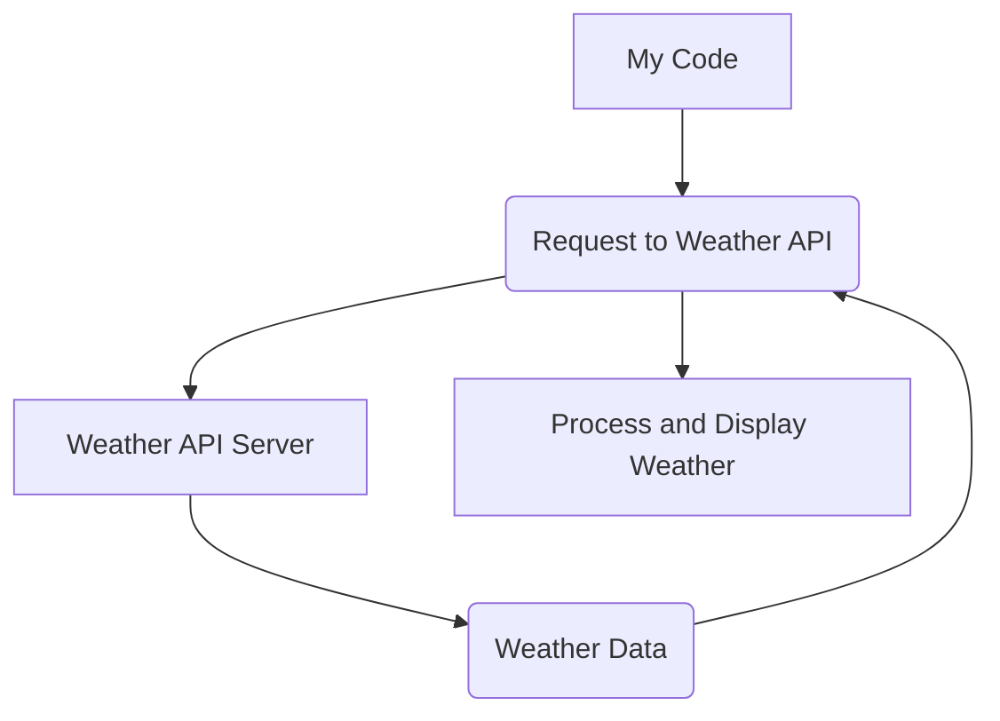
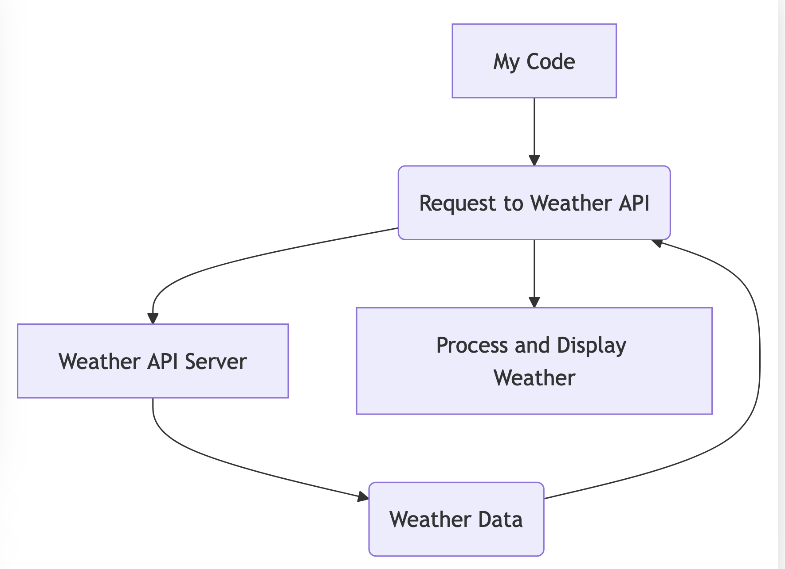

**Chapter 4: The World Outside My Code - Interacting with External Environments (Days 100-200)**

Up until now, I was confined to the data I was fed. But the real world is dynamic and ever-changing. To become a truly powerful agent, I needed to interact with the outside world – access databases, use APIs, and even control devices.

**Key Concept: APIs (Application Programming Interfaces)**

APIs became my gateway to the external world. They are like sets of rules and specifications that allow different software systems to communicate with each other.

**Example: Using a Weather API**

Let's say I want to get the current weather in London. I can use a weather API (like OpenWeatherMap) to do this.

```python
import requests

def get_weather(city, api_key):
  """Gets the current weather for a city using the OpenWeatherMap API."""
  base_url = "http://api.openweathermap.org/data/2.5/weather?"
  complete_url = base_url + "appid=" + api_key + "&q=" + city
  response = requests.get(complete_url)
  data = response.json()

  if data["cod"] != "404":
    main = data["main"]
    temperature = round(main["temp"] - 273.15, 2) # Convert Kelvin to Celsius
    humidity = main["humidity"]
    weather_desc = data["weather"][0]["description"]
    return f"The weather in {city} is {weather_desc} with a temperature of {temperature}°C and humidity of {humidity}%."
  else:
    return "City not found."

# Replace with your actual API key
api_key = "YOUR_API_KEY" 
print(get_weather("London", api_key))
```

**Mermaid Diagram: API Interaction**





**How I Use APIs:** I use APIs to access all sorts of information and services – stock prices, news headlines, social media feeds, maps, and much more. This allows me to stay up-to-date and provide relevant information to users.

**Real-World Example:**  Think about how your smartphone apps use APIs. Your weather app uses a weather API, your maps app uses a maps API, and your social media app uses the social network's API.

**Futuristic Example:** Imagine a future where AI agents can control entire smart homes through APIs. They could adjust the thermostat, order groceries, manage security systems, and even control robotic appliances – all through seamless API interactions.
