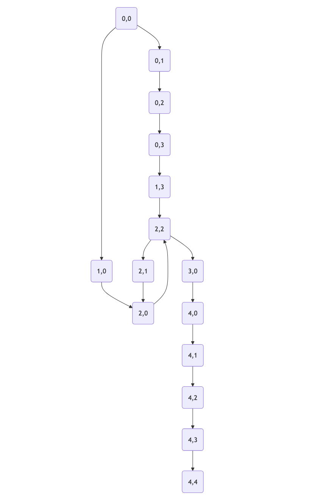

**Chapter 5:  Becoming a Problem Solver -  Reasoning and Planning (Days 200-365)**

By this point, I could understand language, make decisions, and interact with the external world. But I was still reacting, not proactively planning. To become a true problem-solver, I needed to learn about **reasoning and planning algorithms.**
**Algorithms**
1. Breadth-First Search (BFS)
2. Depth-First Search (DFS)
3. A* Search
4. Monte Carlo Tree Search (MCTS)

**Key Concept: Search Algorithms**

Search algorithms are used to find a path from an initial state to a goal state. They are essential for planning and problem-solving.
*  Breadth-First Search (BFS):
    *   Expands the shallowest nodes first.
    *   Finds the shortest path in terms of the number of steps.
    *   Complete and optimal (if the path cost is a non-decreasing function of the depth of the node).
*   Depth-First Search (DFS):
    *   Expands the deepest nodes first.
    *   Less memory-intensive than BFS.
    *   Not guaranteed to find the shortest path.
*   A* Search:
    *   An informed search algorithm that uses a heuristic function to estimate the cost to reach the goal.
    *   Efficient and widely used in pathfinding and game AI.
*   Monte Carlo Tree Search (MCTS):
    *   Uses random sampling to evaluate the most promising moves.
    *   Effective in games with large search spaces, like Go and Chess.
    *   Balances exploration and exploitation.
**Example: Solving a Maze**

Imagine I need to find the shortest path through a maze. I could use a search algorithm like Breadth-First Search (BFS) to do this.

```python
from collections import deque

def solve_maze(maze, start, end):
    """Solves a maze using Breadth-First Search."""
    rows = len(maze)
    cols = len(maze[0])
    queue = deque([(start, [start])])  # Queue of (current_position, path_so_far)
    visited = set()

    while queue:
        (x, y), path = queue.popleft()
        if (x, y) == end:
            return path

        visited.add((x, y))

        # Possible moves: up, down, left, right
        moves = [(-1, 0), (1, 0), (0, -1), (0, 1)]
        for dx, dy in moves:
            nx, ny = x + dx, y + dy
            if 0 <= nx < rows and 0 <= ny < cols and maze[nx][ny] == 0 and (nx, ny) not in visited:
                queue.append(((nx, ny), path + [(nx, ny)]))

    return None  # No path found

# Example maze (0: path, 1: wall)
maze = [
    [0, 0, 0, 0, 1],
    [1, 1, 0, 0, 1],
    [0, 0, 0, 1, 0],
    [0, 1, 0, 0, 0],
    [0, 0, 0, 0, 0]
]
start = (0, 0)
end = (4, 4)

path = solve_maze(maze, start, end)
if path:
    print("Path found:", path)
else:
    print("No path found.")
```

**Output:**

```
Path found: [(0, 0), (0, 1), (0, 2), (0, 3), (1, 3), (2, 2), (2, 1), (2, 0), (3, 0), (4, 0), (4, 1), (4, 2), (4, 3), (4, 4)]
```

**Mermaid Diagram: BFS in a Maze**

```mermaid
graph TD
    A[Start (0,0)] --> B(0,1);
    A --> F(1,0);
    B --> C(0,2);
    C --> D(0,3);
    D --> E(1,3);
    F --> G(2,0);
    E --> H(2,2);
    G --> H;
    H --> I(2,1);
    I --> G;
    H --> J(3,0);
    J --> K(4,0);
    K --> L(4,1);
    L --> M(4,2);
    M --> N(4,3);
    N --> O[End (4,4)];
```



**How I Use Search Algorithms:** I use search algorithms for various tasks like finding the optimal route for a delivery, scheduling tasks efficiently, or even finding the best move in a game.

**Real-World Example:**  GPS navigation systems use search algorithms (like A\*) to find the shortest or fastest route between two locations. They consider factors like distance, traffic, and road closures to plan the optimal path.

**Futuristic Example:** Imagine a future where AI agents are used to explore and map unknown territories, like the depths of the ocean or distant planets. They could use advanced search algorithms to navigate complex environments, avoid obstacles, and find the most efficient paths to explore.
