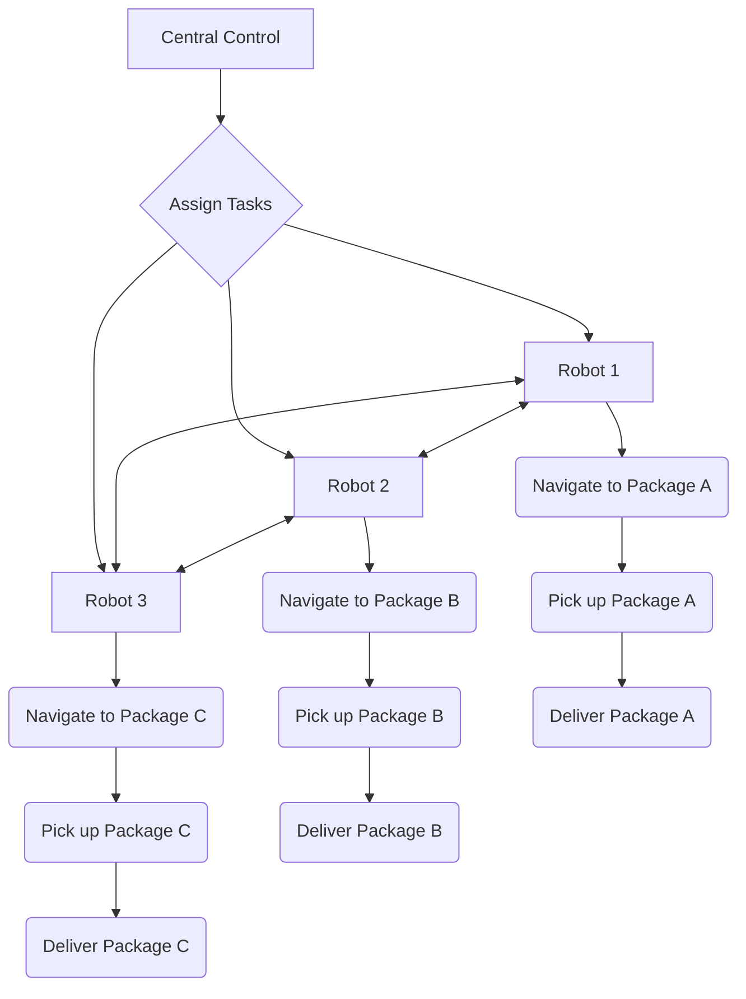
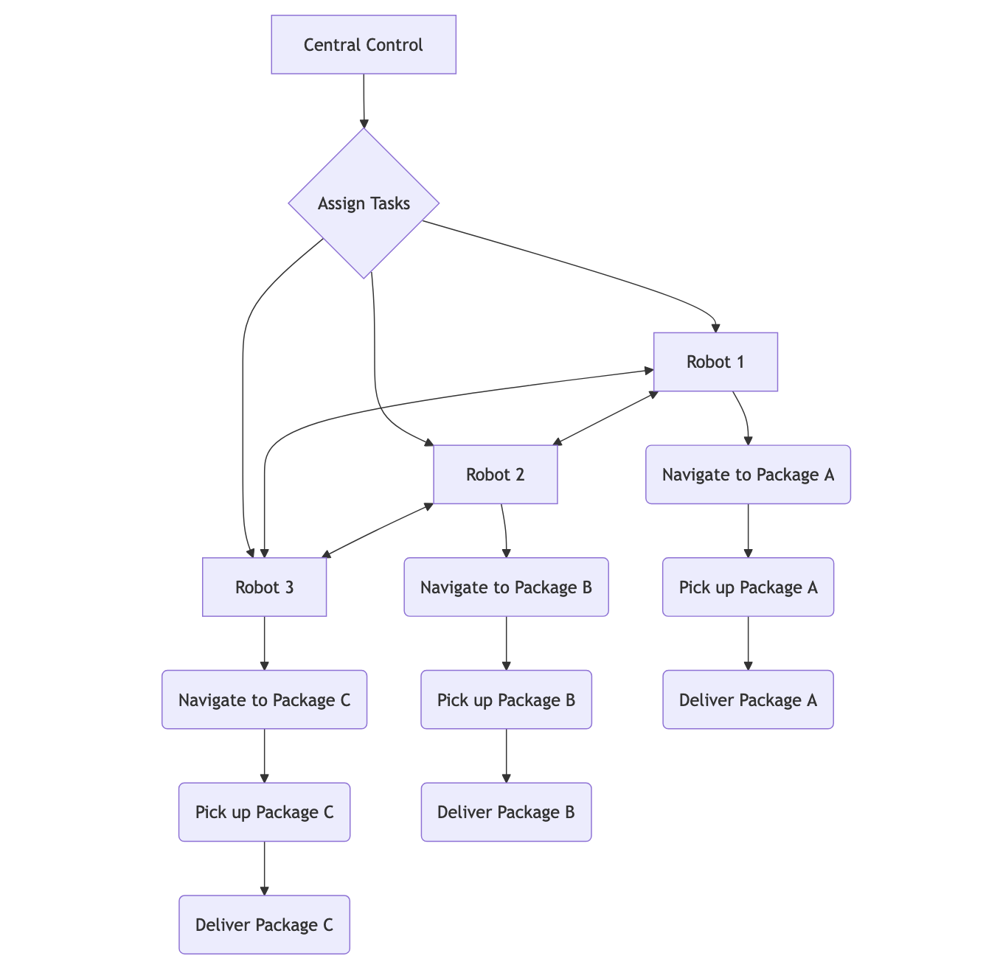

**Chapter 6: The Power of Teamwork - Multi-Agent Systems (Days 365-500)**

So far, I've been a lone wolf, a solitary agent. But the real world often requires collaboration. This is where I entered the exciting world of **multi-agent systems (MAS)**.

**Key Concept: Cooperation and Coordination**

In a multi-agent system, multiple agents work together to achieve a common goal or individual goals that align with each other. This requires:

*   **Communication:** Agents need to be able to exchange information with each other.
*   **Cooperation:** Agents need to be able to work together, sharing resources and coordinating their actions.
*   **Negotiation:** Agents may need to negotiate with each other to resolve conflicts or reach agreements.

**Example: A Team of Delivery Robots**

Imagine a warehouse where a team of robots needs to work together to deliver packages. Each robot is an agent in a multi-agent system.

**Mermaid Diagram: Multi-Agent Delivery System**

**Algorithms:** Game theory, distributed consensus algorithms, and negotiation protocols are examples of tools which can be used for multi agent systems.

**How I Use Multi-Agent Systems:** I can participate in multi-agent systems to collaborate with other agents on tasks like distributed problem-solving, resource allocation, and task scheduling.

**Real-World Example:**  Self-driving cars are a form of multi-agent system. Each car is an agent that needs to communicate and coordinate with other cars on the road to avoid collisions and ensure smooth traffic flow.

**Futuristic Example:** Imagine a future where swarms of AI-powered drones work together to monitor and maintain large-scale infrastructure projects, like bridges or power grids. They could communicate with each other to coordinate their inspections, identify potential problems, and even perform repairs autonomously.
