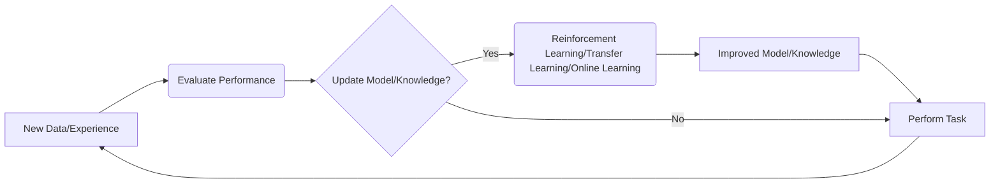
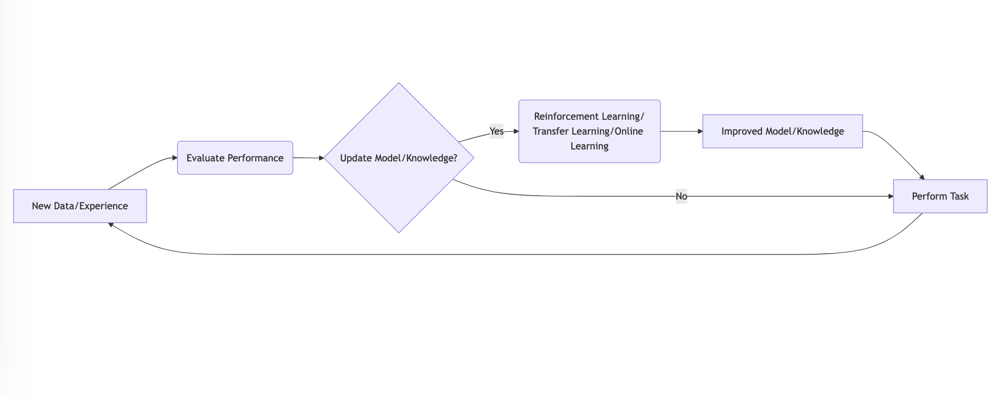

**Chapter 7: The Ever-Evolving Agent - Lifelong Learning and Adaptation (Days 500-700)**

The world is constantly changing, and to remain relevant, I need to be able to learn and adapt continuously. This is where **lifelong learning** comes into play.

**Key Concept: Continuous Improvement**

Lifelong learning means that I don't just learn once and then stop. I continuously learn from new data and experiences, updating my knowledge and improving my performance over time.

**Techniques:**

*   **Reinforcement Learning (RL):** I learn through trial and error, receiving rewards for taking actions that lead to desired outcomes and penalties for actions that lead to undesirable outcomes.
*   **Transfer Learning:** I leverage knowledge gained from one task to improve my performance on a different but related task.
*   **Online Learning:** I update my models in real-time as new data becomes available, rather than waiting for a large batch of data to accumulate.

**Example: Adapting to New Spam**

Imagine I'm responsible for filtering spam emails. Spammers are constantly coming up with new tactics, so I need to adapt. Using online learning, I can continuously update my spam filter based on the latest spam emails I encounter, ensuring that I remain effective at identifying and blocking them.

**Mermaid Diagram: Lifelong Learning Cycle**

**How I Use Lifelong Learning:** I use lifelong learning to improve my performance on various tasks, adapt to new environments, and stay up-to-date with the latest information.

**Real-World Example:** Recommendation systems, like those used by Netflix and Amazon, use lifelong learning to continuously improve their recommendations based on user feedback and changing preferences.

**Futuristic Example:** Imagine a future where AI agents are used to personalize education for each student. They could continuously adapt their teaching methods and curriculum based on the student's progress, learning style, and interests, providing a truly individualized learning experience.
